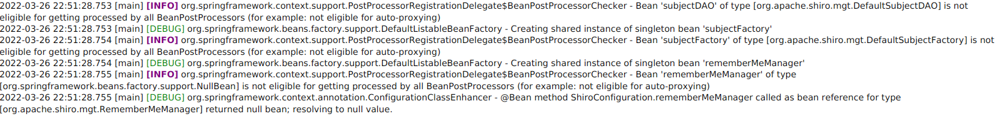

# Table of contents
* [ANSI4J](#ansi4j)
    * [Core](#ansi4j-core)
        * [Overview](#ansi4j-core-overview)
        * [Usage](#ansi4j-core-usage)
        * [Thread-safety](#ansi4j-core-thread)
    * [CSS extension](#ansi4j-css)
        * [Overview](#ansi4j-css-overview)
        * [Usage](#ansi4j-css-usage)
        * [Thread-safety](#ansi4j-css-thread)
        * [Example](#ansi4j-css-example)
    * [Code building](#ansi4j-building)
    * [License](#ansi4j-license)
    * [Feedback](#ansi4j-feedback)
* [Theory](#theory)
    * [Control character](#theory-control)
    * [Control character and encoding](#theory-encoding)
        * [Control character in ASCII](#theory-encoding-ascii)
        * [Control character in Unicode](#theory-encoding-unicode)
    * [Control Function Standards](#theory-standard)
        * [ECMA](#theory-standard-ecma)
        * [ANSI](#theory-standard-ansi)
        * [ISO](#theory-standard-iso)
    * [Types of control functions](#theory-types)
    * [Parameter examples](#theory-parameters)
* [Useful resources](#resources)

# ANSI4J 

ANSI4J is a Java library that parses ANSI escape codes in full accordance with ISO/IEC 6429:1992. It supports all
functions of all five types. At the same time parser architecture allows to add easily any other custom types of
functions and mechanism to process them.

ANSI4J consists of a core that includes parser and CSS extension that allows to create CSS declaration using
function arguments.

## Core 

### Overview 

Core contains all base classes for working with control functions, parsers and text.

Base components:

* `ParserFactory` is thread-safe instance of factory, that can be used for creating N parsers for parsing N texts.
So, usually there is only one factory.
* `Parser` is a non thread-safe object that reads text, manages finder and handlers and returns parsed fragment. 
There are two types of parsers:
    * `StringParser` for parsing `String`. `StringParser` is very light, so it is possible to create it for every text line.
    * `StreamParser` for parsing `InputStream`. One instance of `StreamParser` is created for one instance of `InputStream`.
* `FunctionFinder` finds function in a text and resolves found function.
* `FragmentHandler` is a thread-safe object for processing fragment of text. There are two types of handlers:
    * `TextHandler` is a handler for processing a text that doesn't contain any control functions in it.
      This handler allows to modify this text within system. Default implementation doesn't modify text and just wraps
      it in `TextFragment`.
    * `FunctionHandler` is a handler for processing functions in a text. For every type of function separate function 
    handler exists. As a result `FunctionHandler` returns `FunctionFragment`.
* `Fragment` is a processed piece of text. There are two types of fragments:
    * `TextFragment` that contains information about text pieces without functions.
    * `FunctionFragment` that contains information about functions in text.

### Usage 

Step 0 - Creating `ParserFactory`

    ParserFactory factory = new DefaultParserFactory.Builder()
            .environment(Environment._7_BIT)
            .textHandler(new DefaultTextHandler())
            .functionFinder(new DefaultFunctionFinder())
            //if you don't need some types of functions just don't provide handlers for them
            .functionHandlers(
                    new C0ControlFunctionHandler(),
                    new C1ControlFunctionHandler(),
                    new ControlSequenceHandler(),
                    new IndependentControlFunctionHandler(),
                    new ControlStringHandler())
            .build();

Step 1A - Creating `StringParser`

    //this is the text we are going to parse
    String text = ...;

    //we need a parser
    var parser = factory.createParser(text);

Step 1B - Creating `StreamParser`

    //this is the stream we are going to parse
    InputStream stream = ...;

    //we need a parser, one parser for one stream
    try (var parser = factory.createParser(stream, StandardCharsets.UTF_8, 1024)) {
        ...
    } catch (IOException ex) {
        ...
    }

Step 2 - Parsing

    //so, let's go
    Fragment fragment = null;
    while ((fragment = parser.parse()) != null) {
        if (fragment.getType() == FragmentType.TEXT) {
            TextFragment textFragment = (TextFragment) fragment;
            ...
        } else if (fragment.getType() == FragmentType.FUNCTION) {
            FunctionFragment functionFragment = (FunctionFragment) fragment;
            if (functionFragment.getFunction() == ControlSequenceFunction.SGR_SELECT_GRAPHIC_RENDITION) {
                ...
            }
        }
    }

### Thread-safety 

`ParserFactory` is thread-safe. `StringParser` and `StreamParser` are not thread-safe. `FunctionFinder`, `TextHandler` and 
`FunctionHandler`s are thread-safe. Detailed information about thread-safety is provided in every interface in core API 
module.

## CSS extension 

### Overview 

CSS extension allows to generate CSS declarations one the base of SGR function and its arguments. Currently the
following text attributes are supported: weight, italic, underline, blinking, reverse video, visibility, strikethrough,
font, foreground color, background color.

Important notes:

* To enable blinking with Css3Generator is is necessary to add the following keyframes to your stylesheet:
@keyframes ansi4j-blinker {50% { opacity: 0; }}.
* Blinking with JavaFX using CSS doesn't work, as JavaFX won't support CSS animation until this
[issue](https://bugs.openjdk.java.net/browse/JDK-8283676) is resolved. If blinking is required it is possible to
work with AttributeContext directly and create keyframes programmatically.

Base components:

* `Palette` - ISO 6429 supports only 8 colors (3 bits). However, today many terminals supports 4, 8 and 24 bit colors.
However, these extra colors are not included in the standard. So, to support them use `extraColorsEnabled()` method
in config. `Palette` is an interface, so it is easy to add custom 8, 16, 256 color palette.
* `AttributeConfig` that is created for every `Attribute` enumeration class.
* `AttributeContext` keeps information about current attributes and their values.
* `AttributeResolver` resolves attributes on base of function arguments and saves attributes to context. Finally returns
list of attribute changes.
* `CssGenerator` generates CSS declarations on the base of attribute changes. Currently there are two types of CSS
generators: CSS3 generator and JavaFX CSS generator. The latter one is used when it is required to create styles
for JavaFX nodes.

Such architecture allows easily to create new attribute types and resolvers with CSS generators for them.

### Usage 

    //First of all we create configuration for text attributes.
    var palette = new XtermPalette256();
    AttributeConfig config = new DefaultTextAttributeConfig.Builder()
            .defaultForegroundColor(0x000000)
            .defaultBackgroundColor(0xffffff)
            .fontFamilies(List.of("Arial", "'Times New Roman', Times, serif"))
            .extraColorsEnabled(true)
            .palette16(palette)
            .palette256(palette)
            .build();

    //Now we need context that will keep attributes.
    AttributeContext context = new DefaultAttributeContext(List.of(config));

    //Now we create a function processor.
    var processor = new DefaultCssFunctionProcessor.Builder()
            .resolvers(new DefaultTextAttributeResolver())
            .generators(new JavaFxCssGenerator())
            .build();
    ...
    //To generate CSS declarations we need to process function fragments. Currently only SGR functions are supported
    Fragment fragment = ... ;
    if (fragment.getType() == FragmentType.FUNCTION) {
        FunctionFragment functionFragment = (FunctionFragment) fragment;
        if (functionFragment.getFunction() == ControlSequenceFunction.SGR_SELECT_GRAPHIC_RENDITION) {
            List<String> declarations = processor.process(functionFragment, context);
            var style = String.join(";", declarations);
            ...
        }

    }

### Thread-safety 

Config, processor, attribute resolver and CSS generators are thread-safe. Attribute context is not thread-safe.
Detailed information about thread-safety is provided in every interface in CSS API module.

### Example 

The following text with SGR function (escape character is replaced with ESC):

    2022-03-26 22:51:28.753 [main] ESC[35;1m[INFO]ESC[m org.springframework.context.support.PostProcessorRegistrationDelegate$BeanPostProcessorChecker - Bean 'subjectDAO' of type [org.apache.shiro.mgt.DefaultSubjectDAO] is not eligible for getting processed by all BeanPostProcessors (for example: not eligible for auto-proxying)
    2022-03-26 22:51:28.753 [main] ESC[32m[DEBUG]ESC[m org.springframework.beans.factory.support.DefaultListableBeanFactory - Creating shared instance of singleton bean 'subjectFactory'
    2022-03-26 22:51:28.754 [main] ESC[35;1m[INFO]ESC[m org.springframework.context.support.PostProcessorRegistrationDelegate$BeanPostProcessorChecker - Bean 'subjectFactory' of type [org.apache.shiro.mgt.DefaultSubjectFactory] is not eligible for getting processed by all BeanPostProcessors (for example: not eligible for auto-proxying)
    2022-03-26 22:51:28.754 [main] ESC[32m[DEBUG]ESC[m org.springframework.beans.factory.support.DefaultListableBeanFactory - Creating shared instance of singleton bean 'rememberMeManager'
    2022-03-26 22:51:28.755 [main] ESC[35;1m[INFO]ESC[m org.springframework.context.support.PostProcessorRegistrationDelegate$BeanPostProcessorChecker - Bean 'rememberMeManager' of type [org.springframework.beans.factory.support.NullBean] is not eligible for getting processed by all BeanPostProcessors (for example: not eligible for auto-proxying)
    2022-03-26 22:51:28.755 [main] ESC[32m[DEBUG]ESC[m org.springframework.context.annotation.ConfigurationClassEnhancer - @Bean method ShiroConfiguration.rememberMeManager called as bean reference for type [org.apache.shiro.mgt.RememberMeManager] returned null bean; resolving to null value.

was styled this way in JavaFX (RichTextFX):

## Code building 

To build the library use standard Git and Maven commands:

    git clone https://github.com/PavelKastornyy/ansi4j.git
    cd ansi4j
    mvn clean install

Don't forget to star the project!

## License 

ANSI4J is under the Apache License, Version 2.0, January 2004.

## Feedback 

Any feedback is welcome. Besides, it would be interesting to know for what cases this project is used.
It will help to understand the way the project should go and provide more information in documentation.

# Theory 

## Control character 

In computing and telecommunication, a control character or non-printing character (NPC) is a code point (a number) in a
character set, that does not represent a written symbol. They are used as in-band signaling to cause effects other than
the addition of a symbol to the text. All other characters are mainly printing, printable, or graphic characters,
except perhaps for the "space" character (see ASCII printable characters). Details are
[here](https://en.wikipedia.org/wiki/Control_character).

## Control character and encoding 

### Control character in ASCII 

All entries in the ASCII table below code 32 (technically the C0 control code set) are control characters, including
CR and LF used to separate lines of text. The code 127 (DEL) is also a control character. Extended ASCII sets defined
by ISO 8859 added the codes 128 through 159 as control characters, this was primarily done so that if the high bit was
stripped it would not change a printing character to a C0 control code, but there have been some assignments here,
in particular NEL. This second set is called the C1 set.

The C0 and C1 control code or control character sets define control codes for use in text by computer systems that use
ASCII and derivatives of ASCII. The codes represent additional information about the text, such as the position of a
cursor, an instruction to start a new line, or a message that the text has been received. Details are
[here](https://en.wikipedia.org/wiki/C0_and_C1_control_codes).

### Control character in Unicode 

Many Unicode characters are used to control the interpretation or display of text, but these characters themselves have
no visual or spatial representation. For example, the null character (U+0000 NULL) is used in C-programming application
environments to indicate the end of a string of characters. In this way, these programs only require a single starting
memory address for a string (as opposed to a starting address and a length), since the string ends once the program
reads the null character.

In the narrowest sense, a control code is a character with the general category Cc, which comprises the C0 and C1
control codes, a concept defined in ISO/IEC 2022 and inherited by Unicode, with the most common set being defined in
ISO/IEC 6429. Details are [here](https://en.wikipedia.org/wiki/Unicode_control_characters).

## Control Function Standards 

### ECMA 

The first edition of this Standard ECMA-48 was published in 1976. Further editions followed. The fourth edition,
published in 1986 was adopted by ISO/IEC under the fast-track procedure as second edition of ISO 6429. It
constitutes a repertoire of a large number of control functions the definitions and coded representations of which are
thus standardized. For each application the required selection of control functions can be made from this repertoire.

This fifth edition of Standard ECMA-48, published in 1991, contains the control functions already standardized in the
fourth edition and, in addition, new control functions needed for handling bi-directional texts, i.e. texts
comprising parts written with a left-to-right script and parts written with a right-to-left script.
ECMA Technical Report TR/53 gives further information and examples of handling such texts. The inclusion of these
specialized control functions has required a corresponding adjustment of the definitions of some of the other control
functions. Moreover, the concept of "device" had to be revised.

The fifth edition was contributed to ISO/IEC for adoption as third edition of ISO/IEC 6429.

### ANSI 

The name "ANSI escape sequence" dates from 1979 when ANSI adopted ANSI X3.64. The ANSI X3L2 committee collaborated with
the ECMA committee TC 1 to produce nearly identical standards. These two standards were merged into an international
standard, ISO 6429. In 1994, ANSI withdrew its standard in favor of the international standard.

### ISO 

* ISO 6429:1983 (withdrawn),
* ISO 6429:1988(withdrawn),
* ISO/IEC 6429:1992 (current), almost identical to the fifth edition of ECMA-48. It seems that there is only one
difference - ISO/IEC 6429:1992 has one function more - DEL-DELETE.

## Types of control functions 

Each control function in ECMA-48/5th belongs to one of the following types (section 5.1):

1. elements of the C0 set;
2. elements of the C1 set;
3. control sequences (with parameters and with no parameter);
4. independent control functions;
5. control strings.

## Parameter examples 

* no params or one default value (see 5.4.2, e)) - CSI H
* one explicit param - CSI 10 H
* two default params - CSI ; H
* two params, the first is 7 and the second is the default value - CSI 7; H
* two params, the first is the default value and the second is 7 - CSI ;7 H
* three params, the first is 1, the second is the default value and the third is 4 - CSI 1;;4 H
* two explicit params - CSI 10 ; 20 H
* more explicit params - CSI 1 ; 2 ; 3 ; 4 ; 5 H

Note: spaces near parameters are not used in real function code.

# Useful resources 

* [ECMA-48](https://www.ecma-international.org/publications-and-standards/standards/ecma-48/)
* [ISO/IEC 6429:1992 - preview](https://www.iso.org/obp/ui/#iso:std:iso-iec:6429:ed-3:v1:en)
* [ANSI-X3.64](http://www.noah.org/python/pexpect/ANSI-X3.64.htm)
* [XTerm Control Sequences](https://invisible-island.net/xterm/ctlseqs/ctlseqs.html)
